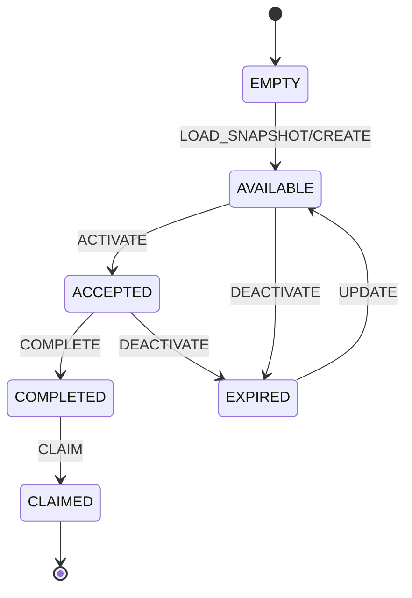
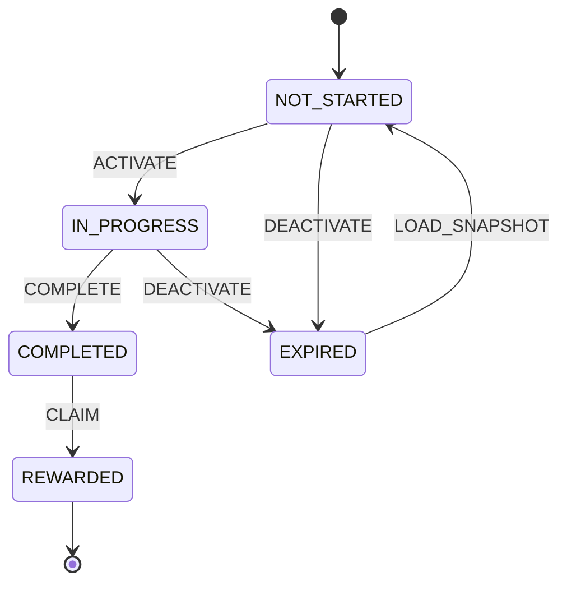
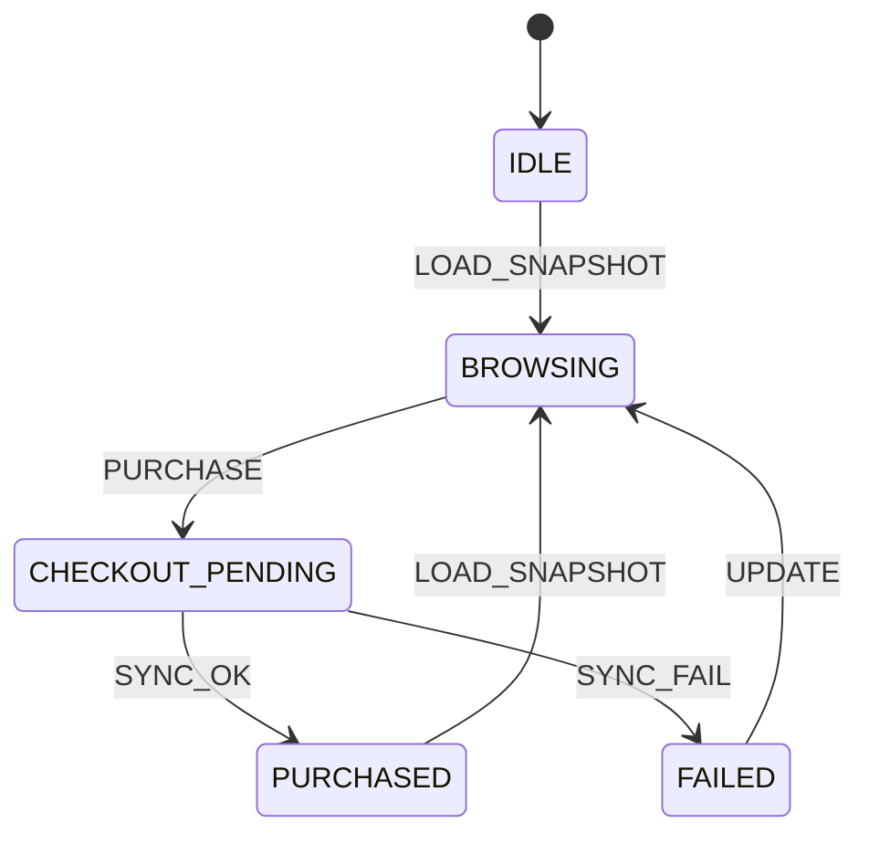
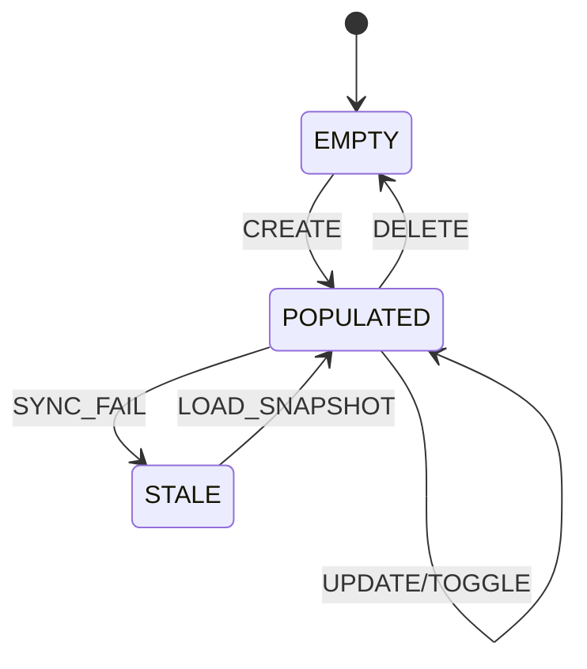

# 11_STATE_MACHINE_OPERACIONAL

## Objetivo
Definir uma máquina de estados operacional para os módulos **Bounty**, **Weekly**, **Shop** e **Preferred List**, padronizando:

- estados válidos;
- eventos permitidos por estado;
- transições inválidas e `ERR_CODE`;
- efeitos colaterais esperados no client;
- política de re-sync com `request snapshot` após erro crítico.

---

## Convenções Globais

### Eventos canônicos
- `LOAD_SNAPSHOT`
- `CREATE`
- `UPDATE`
- `DELETE`
- `ACTIVATE`
- `DEACTIVATE`
- `COMPLETE`
- `CLAIM`
- `PURCHASE`
- `TOGGLE`
- `SYNC_OK`
- `SYNC_FAIL`
- `CRITICAL_ERROR`

### Efeitos colaterais (client)
- **toast**: feedback rápido de sucesso/erro sem bloquear fluxo.
- **modal**: confirmação ou erro bloqueante com ação explícita do usuário.
- **refresh parcial**: atualização incremental do módulo afetado, preservando contexto de tela.

### ERR_CODE globais
- `ERR_INVALID_STATE_TRANSITION`: transição não permitida para o estado atual.
- `ERR_EVENT_NOT_ALLOWED`: evento não permitido no estado atual.
- `ERR_STALE_CLIENT_STATE`: estado local desatualizado em relação ao servidor.
- `ERR_CRITICAL_DESYNC`: divergência crítica detectada; snapshot obrigatório.

---

## 1) Bounty

### 1.1 State chart

### 1.2 Eventos permitidos por estado
| Estado | Eventos permitidos |
|---|---|
| `EMPTY` | `LOAD_SNAPSHOT`, `CREATE` |
| `AVAILABLE` | `UPDATE`, `ACTIVATE`, `DEACTIVATE`, `SYNC_OK`, `SYNC_FAIL` |
| `ACCEPTED` | `UPDATE`, `COMPLETE`, `DEACTIVATE`, `SYNC_OK`, `SYNC_FAIL` |
| `COMPLETED` | `CLAIM`, `SYNC_OK`, `SYNC_FAIL` |
| `CLAIMED` | `LOAD_SNAPSHOT`, `SYNC_OK` |
| `EXPIRED` | `UPDATE`, `LOAD_SNAPSHOT` |

### 1.3 Transições inválidas e ERR_CODE
- `EMPTY -> CLAIMED` via `CLAIM` ⇒ `ERR_EVENT_NOT_ALLOWED`
- `AVAILABLE -> CLAIMED` via `CLAIM` sem `COMPLETE` ⇒ `ERR_INVALID_STATE_TRANSITION`
- `CLAIMED -> ACCEPTED` via `ACTIVATE` ⇒ `ERR_INVALID_STATE_TRANSITION`
- qualquer estado operacional com payload divergente de versão ⇒ `ERR_STALE_CLIENT_STATE`

### 1.4 Efeito colateral esperado no client
- sucesso em `ACTIVATE`, `COMPLETE`, `CLAIM`: **toast** + **refresh parcial** da lista de bounties;
- falha de validação de regra: **toast** de erro;
- erro crítico de consistência: **modal** de re-sync obrigatório.

---

## 2) Weekly

### 2.1 State chart

### 2.2 Eventos permitidos por estado
| Estado | Eventos permitidos |
|---|---|
| `NOT_STARTED` | `LOAD_SNAPSHOT`, `ACTIVATE`, `DEACTIVATE` |
| `IN_PROGRESS` | `UPDATE`, `COMPLETE`, `DEACTIVATE`, `SYNC_OK`, `SYNC_FAIL` |
| `COMPLETED` | `CLAIM`, `SYNC_OK`, `SYNC_FAIL` |
| `REWARDED` | `LOAD_SNAPSHOT`, `SYNC_OK` |
| `EXPIRED` | `LOAD_SNAPSHOT`, `UPDATE` |

### 2.3 Transições inválidas e ERR_CODE
- `NOT_STARTED -> REWARDED` via `CLAIM` ⇒ `ERR_INVALID_STATE_TRANSITION`
- `IN_PROGRESS -> REWARDED` via `CLAIM` sem `COMPLETE` ⇒ `ERR_INVALID_STATE_TRANSITION`
- `REWARDED -> IN_PROGRESS` via `UPDATE` ⇒ `ERR_EVENT_NOT_ALLOWED`
- divergência entre progresso local e servidor ⇒ `ERR_STALE_CLIENT_STATE`

### 2.4 Efeito colateral esperado no client
- `ACTIVATE`/`COMPLETE`/`CLAIM` com sucesso: **toast** + **refresh parcial** do card weekly;
- tentativa de claim antecipado: **toast** de erro;
- detecção de desync crítico: **modal** com call-to-action para re-sync.

---

## 3) Shop

### 3.1 State chart

### 3.2 Eventos permitidos por estado
| Estado | Eventos permitidos |
|---|---|
| `IDLE` | `LOAD_SNAPSHOT` |
| `BROWSING` | `UPDATE`, `PURCHASE`, `SYNC_OK`, `SYNC_FAIL` |
| `CHECKOUT_PENDING` | `SYNC_OK`, `SYNC_FAIL` |
| `PURCHASED` | `LOAD_SNAPSHOT`, `SYNC_OK` |
| `FAILED` | `UPDATE`, `LOAD_SNAPSHOT` |

### 3.3 Transições inválidas e ERR_CODE
- `IDLE -> PURCHASED` via `SYNC_OK` sem `PURCHASE` ⇒ `ERR_INVALID_STATE_TRANSITION`
- `BROWSING -> PURCHASED` sem passar por `CHECKOUT_PENDING` ⇒ `ERR_INVALID_STATE_TRANSITION`
- `CHECKOUT_PENDING -> CHECKOUT_PENDING` via novo `PURCHASE` concorrente ⇒ `ERR_EVENT_NOT_ALLOWED`
- saldo/preço divergente entre client e servidor ⇒ `ERR_STALE_CLIENT_STATE`

### 3.4 Efeito colateral esperado no client
- compra confirmada: **toast** de sucesso + **refresh parcial** de saldo/inventário;
- falha transacional recuperável: **toast** de erro e retorno para browsing;
- erro crítico de ledger: **modal** bloqueante e disparo de snapshot.

---

## 4) Preferred List

### 4.1 State chart

### 4.2 Eventos permitidos por estado
| Estado | Eventos permitidos |
|---|---|
| `EMPTY` | `LOAD_SNAPSHOT`, `CREATE` |
| `POPULATED` | `UPDATE`, `DELETE`, `TOGGLE`, `SYNC_OK`, `SYNC_FAIL` |
| `STALE` | `LOAD_SNAPSHOT` |

### 4.3 Transições inválidas e ERR_CODE
- `EMPTY -> EMPTY` via `DELETE` ⇒ `ERR_EVENT_NOT_ALLOWED`
- `STALE -> POPULATED` via `UPDATE` sem snapshot ⇒ `ERR_INVALID_STATE_TRANSITION`
- `POPULATED -> STALE` por conflito de versão persistente ⇒ `ERR_STALE_CLIENT_STATE`
- inconsistência estrutural da lista (duplicidade impossível) ⇒ `ERR_CRITICAL_DESYNC`

### 4.4 Efeito colateral esperado no client
- operações normais (`CREATE`, `UPDATE`, `TOGGLE`, `DELETE`): **toast** + **refresh parcial** da lista;
- conflito de versão: **toast** com orientação de sincronização;
- divergência crítica: **modal** com re-sync obrigatório.

---

## Política de Re-sync (`request snapshot`) após erro crítico

### Disparadores
Executar `request snapshot` imediatamente quando ocorrer:

1. `ERR_CRITICAL_DESYNC`;
2. repetição de `ERR_STALE_CLIENT_STATE` acima do limiar (`>= 2` operações seguidas no mesmo módulo);
3. resposta do servidor sem invariantes mínimas do módulo (ex.: item inexistente em estado terminal).

### Fluxo padrão
1. Congelar mutações locais do módulo (`write-lock` lógico).
2. Exibir **modal** informando “sincronização obrigatória em andamento”.
3. Disparar `LOAD_SNAPSHOT`/`request snapshot` para o módulo afetado.
4. Aplicar snapshot no estado local e recalcular derivados de UI.
5. Liberar mutações locais.
6. Exibir **toast** de sucesso (“dados sincronizados”) ou erro final (com opção de retry).

### Regras de UX
- Re-sync é **parcial por módulo**, evitando reload global da interface.
- Enquanto o módulo estiver em re-sync, ações ficam desabilitadas apenas nele.
- Ao falhar 3x consecutivas no snapshot, promover para estado de contingência com **modal** persistente e opção “Tentar novamente”.

### Observabilidade mínima recomendada
Registrar no client/server:
- módulo;
- estado de origem;
- evento recebido;
- `ERR_CODE`;
- versão local vs versão do servidor;
- duração do ciclo de re-sync.
