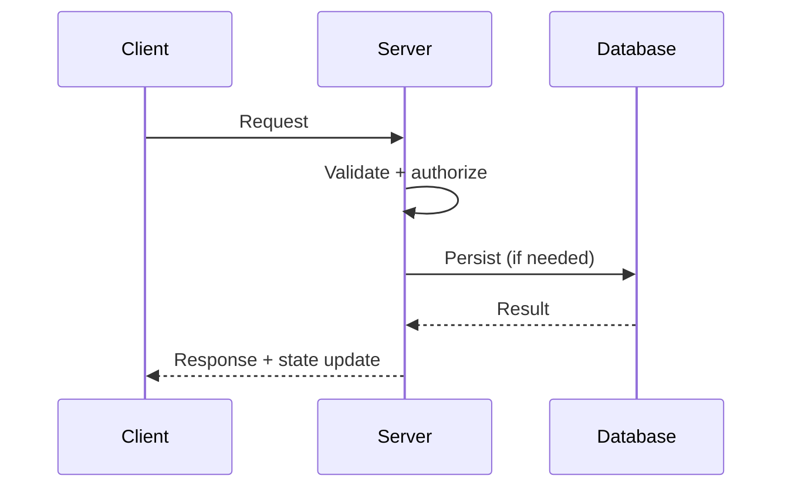

# Task Execution Template

Use this template for any medium/high complexity request.

## A. Scope Lock
- Task title:
- Owner:
- Date:

### Problem Statement
-

### In Scope
-

### Out of Scope
-

### Affected Subsystems
- Server:
- Client:
- Data/DB:
- Protocol:

### Compatibility Strategy
- [ ] Dual-path support
- [ ] Feature-flagged rollout
- [ ] Breaking change with migration window
- Notes:

### Migration Plan
-

---

## B. Design Review

### Sequence Diagram (Mermaid)


### Failure Modes
| Failure | Detection | Mitigation | User impact |
|---|---|---|---|
|  |  |  |  |

### Security Impact
- Auth/AuthZ:
- Input validation:
- Trust boundaries:
- Sensitive logging review:

Reviewer sign-off:
-

---

## C. Implementation Plan
- [ ] Server-authoritative validation implemented.
- [ ] Backward compatibility gate added.
- [ ] Feature flag added (or N/A with rationale).
- [ ] Metrics/logging added for new path.
- [ ] Docs/configs updated.

Files to change:
-

---

## D. Validation Plan
### Functional
- [ ] Unit tests
- [ ] Integration tests

### Non-Functional
- [ ] Load/soak test
- [ ] Security checks

### Test Commands
```bash
# list exact commands used
```

Expected pass criteria:
-

---

## E. Rollout Plan
### Stages
1.
2.
3.

### Observability
- Dashboards:
- Alerts:

### Rollback Criteria
- Trigger thresholds:
- Rollback steps:

Post-release checks:
-
